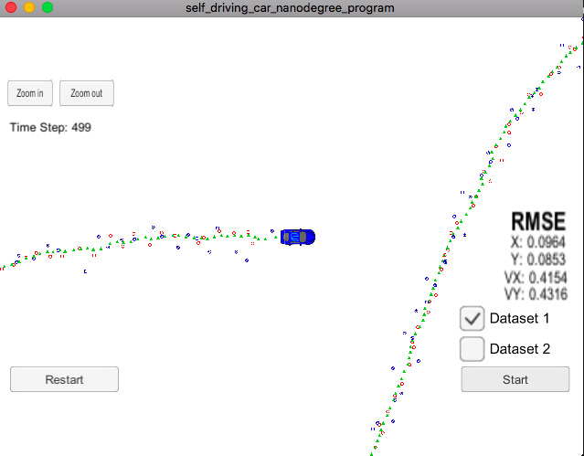
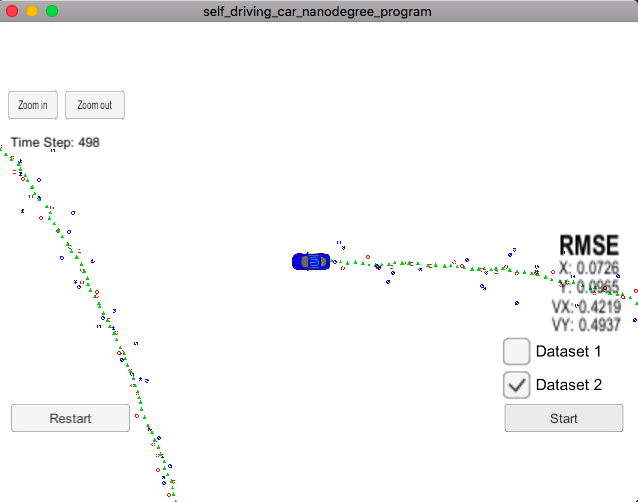

# CarND-Extended-Kalman-Filter-P1

Udacity Self Driving Car Nanodegree Term#2 Project#1

## Overview
---

This project consist of implementing [Extended Kalman Filter](https://en.wikipedia.org/wiki/Extended_Kalman_filter) with `C++`. A simulator was provided by Udacity which can be downloadable from [here](https://github.com/udacity/self-driving-car-sim/releases), which generates `RADAR` and `LIDAR` data for populating Object position and velocity. Later Extended Kalman Filter will fuse them together to predict their future positions and velocity.

This repository includes two files that can be used to set up and install [uWebSocketIO](https://github.com/uWebSockets/uWebSockets) for either Linux or Mac systems. For windows you can use either Docker, VMware, or even [Windows 10 Bash on Ubuntu](https://www.howtogeek.com/249966/how-to-install-and-use-the-linux-bash-shell-on-windows-10/) to install uWebSocketIO. Please see [this concept in the classroom](https://classroom.udacity.com/nanodegrees/nd013/parts/40f38239-66b6-46ec-ae68-03afd8a601c8/modules/0949fca6-b379-42af-a919-ee50aa304e6a/lessons/f758c44c-5e40-4e01-93b5-1a82aa4e044f/concepts/16cf4a78-4fc7-49e1-8621-3450ca938b77) for the required version and installation scripts.

## Prerequisites
---

The project requires following packages/dependencies to be installed on system

* cmake >= 3.5
  * All OSes: [click here for installation instructions](https://cmake.org/install/)
* make >= 4.1 (Linux, Mac), 3.81 (Windows)
  * Linux: make is installed by default on most Linux distros
  * Mac: [install Xcode command line tools to get make](https://developer.apple.com/xcode/features/)
  * Windows: [Click here for installation instructions](http://gnuwin32.sourceforge.net/packages/make.htm)
* gcc/g++ >= 5.4
  * Linux: gcc / g++ is installed by default on most Linux distros
  * Mac: same deal as make - [install Xcode command line tools](https://developer.apple.com/xcode/features/)
  * Windows: recommend using [MinGW](http://www.mingw.org/)
* Udacity's Simulator [Download](https://github.com/udacity/self-driving-car-sim/releases)

# Build Steps

To build/compile the binary for `ExtendedKF`, following steps needs to be performed.

    mkdir build
    cd build
    cmake ..
    make
    ./ExtendedKF

Tips for setting up your environment can be found [here](https://classroom.udacity.com/nanodegrees/nd013/parts/40f38239-66b6-46ec-ae68-03afd8a601c8/modules/0949fca6-b379-42af-a919-ee50aa304e6a/lessons/f758c44c-5e40-4e01-93b5-1a82aa4e044f/concepts/23d376c7-0195-4276-bdf0-e02f1f3c665d)

## Communicating with Simulator
---

The main protcol that main.cpp uses for `uWebSocketIO` in communicating with the simulator.

    INPUT: values provided by the simulator to the c++ program

    ["sensor_measurement"] => the measurement that the simulator observed (either lidar or radar)

    OUTPUT: values provided by the c++ program to the simulator

    ["estimate_x"] <= kalman filter estimated position x
    ["estimate_y"] <= kalman filter estimated position y
    ["rmse_x"]
    ["rmse_y"]
    ["rmse_vx"]
    ["rmse_vy"]

## Code Style

Please (do your best to) stick to [Google's C++ style guide](https://google.github.io/styleguide/cppguide.html).

## Generating Additional Data

This is optional!

If you'd like to generate your own radar and lidar data, see the [utilities repo](https://github.com/udacity/CarND-Mercedes-SF-Utilities) for Matlab scripts that can generate additional data.

## Project Instructions and Rubric

More information is only accessible by people who are already enrolled in Term 2 of CarND. If you are enrolled, see [the project resources page](https://classroom.udacity.com/nanodegrees/nd013/parts/40f38239-66b6-46ec-ae68-03afd8a601c8/modules/0949fca6-b379-42af-a919-ee50aa304e6a/lessons/f758c44c-5e40-4e01-93b5-1a82aa4e044f/concepts/382ebfd6-1d55-4487-84a5-b6a5a4ba1e47) for instructions and the project rubric.

## [Rubric](https://review.udacity.com/#!/rubrics/748/view) Points

### Compiling

* Your code should compile.

  Code compiles successfully without any errors with the use of `cmake` and `make`. Detailed steps provided above in `Build Steps`

### Accuracy

* px, py, vx, vy output coordinates must have an RMSE <= [.11, .11, 0.52, 0.52] when using the file: "obj_pose-laser-radar-synthetic-input.txt" which is the same data file the simulator uses for Dataset 1.

Extended Kalman Filter accuracy at end of path for given two datasets are as given below which meets the requirement of `RMSE <= [.11 .11 .52 .52]` when using file `obj_pose-laser-radar-synthetic-input.txt` which is same data file as `Dataset 1`. Although I have tested with `Dataset 2` and that meets requirement too:

  * **Dataset 1**: `RMSE = [0.0964 0.0854 0.4154 0.4316]`
  * **Dataset 2**: `RMSE = [0.0726 0.0965 0.4219 0.4937]`

*Result from Dataset 1*

*Result from Dataset 2*

### Follows the Correct Algorithm

* Your Sensor Fusion algorithm follows the general processing flow as taught in the preceding lessons.

  I have used usual `Kalman Filter` to update measurement matrices for `LIDAR/LASER` inputs by using equation `y = z - Hx`. Whereas, I have used `Extended Kalman Filter` to update measurement matrices for `RADAR` inputs by calculating `Jacobian Matrix (Hj)` and computed position with equation `y = z - Hj`.

  Implementation can be found in `src/kalman_filter.cpp` (line 57) and was called from `src/FusionEKF.cpp` (line 168).

* Your Kalman Filter algorithm handles the first measurements appropriately.

  I have initialized object positions for kalman filter measurement matrix from the most recent data received. For `RADAR` data inputs, I have first converted them to `Cartesian` Coordinate system from the `Polar` Coordiante system.

  Implementation can be found in `src/FusionEFK.cpp` (line 75-121).

* Your Kalman Filter algorithm first predicts then updates.

  I have updated State transition matrix `F_` and process noise covariance matrix `Q_`, based on the `timestamp` difference in seconds, prior to performing predictions. (Implemented at `src/FusionEKF.cpp` line 135-156). `KalmanFilter::Predict()` is implemented at line 24).

  For `RADAR`, `UpdateEKF()` computes updated positions based on `y = z - Hj`, where `Hj=Jacobian Matrix`. Implementation for calculating `Jacobian Matrix (Hj)` is in `src/tools.cpp` at line 52-82. Implementation of `UpdateEKF()` is in `src/kalman_filter.cpp` at line 57-97. `UpdateEKF()` also attempts to adjust value of `phi` to be in-range of (-2π, 2π).

  For `LIDAR/LASER`, `Update()` computes updated positions for object which was computed with `y = z - Hx` equation. Implementation of `Update()` is in `src/kalman_filter.cpp` at line 35-54.

* Your Kalman Filter can handle radar and lidar measurements.

  I have implemented Kalman Filter to update for `RADAR` as well as `LIDAR/LASER` data points and predict object position and velocity based on both data points or one of them.

### Code Efficiency

* Your algorithm should avoid unnecessary calculations.

  Algorithm computes with minimal computational cost possible.